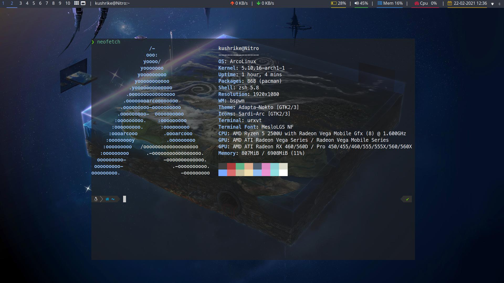

<div align="center">
  
</div>

## Desktop


## Setting Up
```  
git init --bare $HOME/.cfg  
alias config='/usr/bin/git --git-dir=$HOME/.cfg/ --work-tree=$HOME'  
config config --local status.showUntrackedFiles no  
```  
  
## Installing from my setup
```  
alias config='/usr/bin/git --git-dir=$HOME/.cfg/ --work-tree=$HOME'  
echo ".cfg" >> .gitignore  
git clone --bare git@github.com:kushrike/.dotfiles.git $HOME/.cfg  
alias config='/usr/bin/git --git-dir=$HOME/.cfg/ --work-tree=$HOME'  
config checkout  

In case of error,  
mkdir -p .config-backup && \  
config checkout 2>&1 | egrep "\s+\." | awk {'print $1'} | \  
xargs -I{} mv {} .config-backup/{}  
config checkout
```

